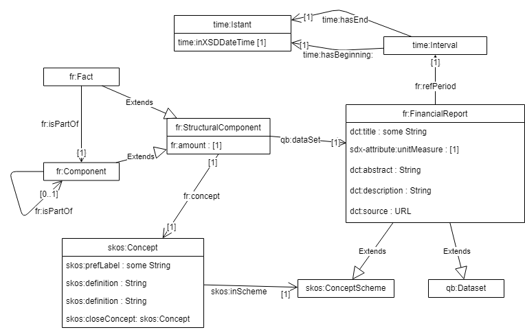
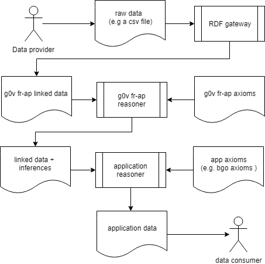

g0v fr-ap: a financial report application profile
=================================================

g0v fr-ap  is a specification based on [Financial Report Vocabulary](http://linkeddata.center/botk-fr/v1) suitable to annotate government data 
with the purpose of supporting budget visualization applications (e.g. http://budget.g0v.it/).  

It captures different perspectives of a government budget data like historical trends, cross-department and component breakdown of tax by government. 

g0v fr-ap is a semantic web application that builds upon the following RDF vocabularies:: 

- the [W3C RDF Data Cube Vocabulary](https://www.w3.org/TR/vocab-data-cube), to describe data observations and statistics.
- the [Financial Report Vocabulary](http://linkeddata.center/botk-fr/v1) that extends the Data Cube Vocabulary with classes, attributes and bindings about a generic Financtial reports.
- the [Data Catalog Vocabulary](https://www.w3.org/TR/vocab-dcat/) to describe the dataset metadata
- the [SKOS](https://www.w3.org/TR/skos-primer) to describe balance taxonomy.
- the [DCMI Metadata Terms](http://dublincore.org/documents/dcmi-terms/)
- some facilities from [sdmx ontologies](https://sdmx.org/)

g0v fr-ap also reuses some individual references to linked open data provided by [UK e-gov](https://github.com/alphagov/datagovuk_reference) and by 
[Currency EU vocabulary](http://publications.europa.eu/resource/authority/currency).

This picture summarize the g0v fr-ap restrictions:




In this snippet (in RDF turtle format) describes a provisional financial report as linked data with FR:

```
@prefix fr: <http://linkeddata.center/botk-fr/v1#>.
@prefix kees: <http://linkeddata.center/kees/v1#> .
@prefix skos: <http://www.w3.org/2004/02/skos/core#> .
@prefix dct:  <http://purl.org/dc/terms/> .
@prefix daq: <http://purl.org/eis/vocab/daq#>.
@prefix interval: <http://reference.data.gov.uk/def/intervals/> .
@prefix qb:       <http://purl.org/linked-data/cube#> .
@prefix : <#>.

:2018_budget_report a fr:FinancialReport ;
	dcat:theme <https://it.dbpedia.org/resource/Bilancio_dello_Stato> ;
	fr:refPeriod <http://reference.data.gov.uk/id/gregorian-interval/2018-01-01T00:00:00/P1Y> ;
	fr:unit <http://publications.europa.eu/resource/authority/currency/EUR> .
	
:facx_x a fr:Fact;
	fr:concept :level_5_account_02001200010001 ;
	qb:dataSet :2018_budget_report ;
	fr:amount 288149000000.00	.

:facx_y a fr:Fact;
	fr:concept :level_5_account_02001200020001 ;
	qb:dataSet :2018_budget_report ;
	fr:amount 881493000.00	.
	
:level_5_account_A102001200010001 a skos:Concept ;skos:broader :level_4_account_A10200120001 .
:level_5_account_A102001200020001 a skos:Concept ;skos:broader :level_4_account_A10200120002 .
:level_4_account_A10200120001 a skos:Concept ; skos:broader :level_3_account_A1020012 .
:level_3_account_A1020012 a skos:Concept ; skos:broader :level_2_account_A102 .
::level_2_account_A102 a skos:Concept ; skos:broader :top_level_account_A1 .
:top_level_account_A1 a skos:Concept .
:budget_taxonomy a skos:ConceptScheme; skos:hasTopConcept :top_level_account_A1 .

```

A reasoner that is able to understand SKOS and FR axioms is able to generate CUBE canonical observations e.g:

```
:facx_x a fr:Fact, qb:Observable;
	fr:concept :level_5_account_02001200010001 ;
	qb:dataSet :2018_budget_report ;
	fr:refPeriod <http://reference.data.gov.uk/id/gregorian-interval/2018-01-01T00:00:00/P1Y> ;
	fr:unit <http://publications.europa.eu/resource/authority/currency/EUR> ;
	fr:isPartOf :component_z ;
	fr:amount 288149000000.00	.

:component_z a fr:Component;
    fr:concept :level_4_account_A10200120001;
    fr:hasPart :facx_x;
    fr:isPartOf :component_k.
    
:level_4_account_A10200120001 a skos:Concept ; 
    skos:broader :level_3_account_A1020012 ;
    skos:narrower 
        :level_5_account_A102001200010001,
        :level_5_account_A102001200020001 .

...

```

## How to use fr-ap

If you want to write an application that analyzes/visualizes budget data, first you have to transform the government budget raw data in RDF linked 
data according to fr-ap classes and properties. 

Then you reason about data and infer tha missing RDF statements (see axioms directory as example). After reasoning
you shoudl check the integrity of resulting Knowledge Base (see tests).

Last, with SPARQL you model the financial information as requested by your selected visualization/analysis tool (for example a bubble graph).
You can both materialize the visual application data model in the knowledge base with SPARQL Update or creating it on the fly querying the
knowledge base with [SPARQL language](http://www.w3.org/TR/sparql11-query/). If your visualization app is Semantic Web aware (e.g. a Solid application),
nothing else is required. If your app requires a json interface, you probably will provide an extra API layer.

In this picture shows the typical workflow:




The directory [examples](examples/) provides some data examples.
The directory [axioms](axioms/) provides some data and axioms ready to use in a RDF store with a SPARQL update.
The directory [tests](tests/) provides some tests to verify the integrity of a knowledge base respect g0v-ap application profile

With [Docker](https://docker.com), you can create and test an example knowledge base running the 
run_tests.sdaas in [LinkedData.Center SDaaS platform](http://linkeddata.center/):

```
docker run -d -p 80:8080 -v $PWD/.:/workspace --name kb linkeddatacenter/sdaas-ce
docker exec -ti kb sdaas -f run_tests.sdaas --reboot
```

logs info and debug traces will be created in `.cache` directory.

To access the knowledge base point a browser to http://localhost/sdaas

Free the running docker container with the `docker rm -f kb` command.
