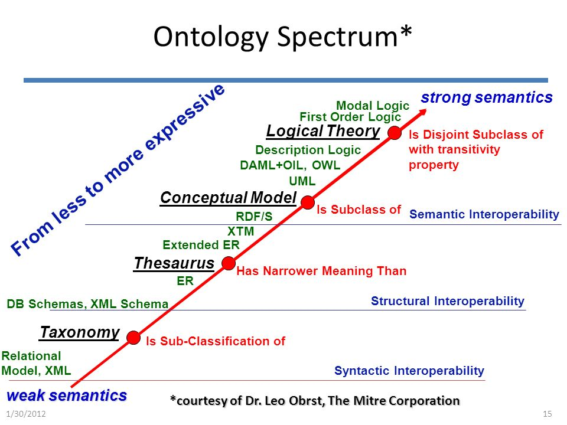
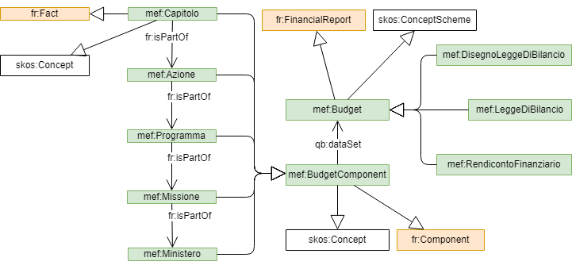

g0v mef ontology
==============

The [Italian budget](https://openbdap.mef.gov.it/it/BdS) is a set of living financial reports defined by the Italian Government in the scope of the *[manovra finanziaria](https://openbdap.mef.gov.it/it/Home/LaManovra)*.

The *g0v mef ontology* is a conceptual model developed by the [g0v.it civic hacking team](https://g0v.it)
to represent the Italian budget and its its historical perspective.

An ontology is made up of formal statements about Classes (i.e. sets of things) and Properties (ways that things relate to other things); *g0v mef ontology*  defines the sets of things that are of interest in describing the MEF world, and the ways that those things can relate to one another. 
In this way, *g0v mef ontology* adds formal meaning to the raw data that are published in the [BDAP Open Data Catalog](https://bdap-opendata.mef.gov.it/catalog) by the [Ministero dell'Economia e delle Finanze](http://www.mef.gov.it/) (MEF).





## Accessing g0v mef ontology

*g0v mef ontology* is technically expressed in the RDF/OWL - the language of the World Wide Web for machine readable inference processing. 
It is very expressive and linguistically aligned with how people think and speak - but expressed in a way that machines can process 
based on mathematical formulas and description logic. By taking advantage of the RDF/OWL Web standard, *g0v mef ontology* uses machine 
intelligence and network graph capabilities to express, enrich, classify and link data in ways that were not previously possible.

The RDF/OWL source [is available in a file](mef.rdf) serialized using XML RDF notation. 
The RDF/OWL file can be embedded in computer applications that can perform logic functions such as inferring classifications and relationships.

You can access this ontology with:
 
- navigate the *g0v mef ontology* with [WebOwl](http://visualdataweb.de/webvowl/#iri=http://w3id.org/g0v/it/mef)
- read the html document generated by [LODE](http://150.146.207.114/lode/extract?url=http://w3id.org/g0v/it/mef)
- edit *g0v mef ontology* with [Standford University Protégeè](https://protege.stanford.edu/)

 
## The mef vocabulary

The mef Vocabulary extends the [Financial Report](http://linkeddata.center/botk-fr/v1) and [SKOS](http://www.w3.org/2004/02/skos/core) vocabularies.

The namespace for *g0v mef ontology* is *http://w3id.org/g0v/it/mef#* and the suggested prefix is *mef:*




The Italian budget (mef:Budget) exists in three main states that evolve by releases:

- *Disegno di Legge di Bilancio* (mef:DisegnoLeggeBilancio): published yearly by the Italian government (usually at the beginning of November) and presented to the Italian Parliament and to the EU commission for approval.
- *Legge di Bilancio* (mef:LeggeBilancio): approved by the Italian Parliament usually before the end of the year
- *Rendiconto* (mef:Rendiconto): approved by the Italian Parliament as a consolidated view of the budget data

In each state more than one release  can be published.

**mef:Budget** is an extension of fr:FinancialReport  

To capture this life cycle, fr:versionId uses the convention <YEAR><REPORT TYPE>[RELEASE]:

- <YEAR> refers to the reference year of the financial document,
- <REPORT TYPE> refers to the main budget state: 
    - **DB** means *Disegno di Legge di Bilancio*, 
    - **LB** means *Legge di Bilancio*, 
    - **RB** means *Rendicont Bilancioo*
- [RELEASE] refers to an optional document release  

e.g.:

- *2020DB* means the first release of *Disegno di Legge di Bilancio* relative to 2020 year as published in Nov. 2019)
- *2019LB* means the first release of *Legge di Bilancio* relative to 2019 year as approved by the Italian Parliament ( in Dec. 2018)
- *2018RB2* means release 2 of *Rendiconto* relative to 2018 year as approved by the Italian Parliament (in 2019)


### Restrictions & Mappings


- **mef:StructuralComponents** is an extension of fr:StructuralComponents that exports three distinct metrics ;
- the **mef:competenza**, **mef:cassa** and **mef:residui** are monetary metrics always expressed in EURO;
- the **fr:refPeriod** refers always to a full solar year period;
- **mef:StructuralComponent** is a skos:Concept;
- **fr:isPartOf** should be considered as a sub-property of skos:broaderTransitive;
- **mef:StructuralComponents** in different **mef:Budget** with the same skos:notation should be considered related with skos:closeConcept properties;
- a **mef:StructuralComponents** can be skos:inScheme of one or more taxonomies exposed by **mef:Budget**;


### Taxonomies

A budget exposes some  classification scheme:

- taxonomies related to expenses (S):
    - mef:hasSchemeSMMPACP (**Ministero->Missione->Programma->Azione->Capitolo di spesa->Piano di gestione**)
    - mef:hasSchemeSMRMP (**Ministero->Centro di responsabilità->Missione->Programma**)
    - mef:hasSchemeSMTC (**Ministero->Titolo spesa->Categoria**)
    - mef:hasSchemeSTCCP (**Titolo di spesa->Categoria->Capitolo->Piano di gestione**)
    - mef:hasSchemeSMP (**Missione->Programma**)
- taxonomies related to incomings (E):	
    - mef:hasSchemeETNT (**Titolo entrata->Natura->Tipologia**)
    - mef:hasSchemeETTPCA (**Titolo entrata->Tipologia->Provento->Capitolo->Articolo**)
    

## Axioms

**taxonomies building**

```sparql-query
CONSTRUCT {
	?budget
		mef:hasSchemeSMMPACP [  a skos:ConceptScheme; kos:hasTopConcept  ?spese ] ;
		mef:hasSchemeSMRMP [  a skos:ConceptScheme; kos:hasTopConcept  ?spese ] ;
		mef:hasSchemeSMTC [  a skos:ConceptScheme; kos:hasTopConcept  ?spese ] ;
		mef:hasSchemeSTCCP [  a skos:ConceptScheme; kos:hasTopConcept  ?spese] ;
		mef:hasSchemeSMP [  a skos:ConceptScheme; kos:hasTopConcept  ?spese ] ;
		mef:hasSchemeETNT [ a skos:ConceptScheme; kos:hasTopConcept  ?entrate ] ;
		mef:hasSchemeETTPCA [ a skos:ConceptScheme; kos:hasTopConcept  ?entrate ] 
}
WHERE { ?budget mef:entrate ?entrate ; mef:uscite ?uscite }


CONSTRUCT {?concept skos:inScheme ?scheme }
WHERE  { 
	{		
		?concept a ?component; qb:dataSet/mef:hasSchemeSMMPACP ?scheme .
		VALUES ?component {
			mef:Ministero
			mef:Missione
			mef:Programma
			mef:Azione
			mef:CapitoloDiSpesa
			mef:PianoDiGestione
		}
	} 
	UNION
	{
		?concept a ?component; qb:dataSet/mef:hasSchemeSMRMP ?scheme .
		VALUES ?component {
			mef:Ministero
			mef:CentroResponsabilita
			mef:Missione
			mef:Programma
		}
	} 
	UNION
	{
		?concept a ?component; qb:dataSet/mef:hasSchemeSMTC ?scheme  .
		VALUES ?component {
			mef:TitoloSpesa
			mef:CategoriaSpesa
		}
	} 
	UNION
	{
		?concept a ?component; qb:dataSet/mef:hasSchemeSTCCP ?scheme  .
		VALUES ?component {
			mef:TitoloSpesa
			mef:CategoriaSpesa
			mef:CapitoloDiSpesa
			mef:PianoDiGestione
		}		
	} 
	UNION
	{
		?concept a ?component; qb:dataSet/mef:hasSchemeSMP ?scheme  .
		VALUES ?component {
			mef:Missione
			mef:Programma
		}		
	} 
	UNION
	{
		?concept a ?component; qb:dataSet/mef:hasSchemeETNT ?scheme  .
		VALUES ?component {
			mef:TitoloEntrata
			mef:Natura
			mef:Tipologia
		}
	} 
	UNION
	{
		?concept a ?component; qb:dataSet/mef:hasSchemeETTPCA ?scheme  .
		VALUES ?component {
			mef:TitoloEntrata
			mef:Tipologia
			mef:Provento
			mef:CapitoloEntrata
			mef:Articolo
		}		
	} 
}

```


**The value of the component metrics is computed as the sum of the related facts**

```sparql-query
CONSTRUCT { 
	?component 
		mef:competenza ?competenzaSum ;
		mef:cassa ?cassaSum ;
		mef:residui ?residuiSum
}
WHERE {
	SELECT ?component (SUM(?competenza) AS ?competenzaSum) (SUM(?cassa) AS ?cassaSum) (SUM(?residui) AS ?residuiSum) WHERE {
		?fact a mef:Fact ;  
			fr:isPartOf+ ?component  ;
			mef:competenza ?competenza;
			mef:cassa ?cassa ;
			mef:residui ?residui; 
	} GROUP BY ?component
}	
```


**mef:StructuralComponent history inference:**

```sparql
CONSTRUCT { 
	?oldFactOrComponent dct:hasVersion ?newFactOrComponent .	
	?newFactOrComponent dct:isVersionOf ?oldFactOrComponent .	
	?newFactOrComponent skos:closeConcept ?oldFactOrComponent .
	?oldFactOrComponent skos:closeConcept ?newFactOrComponent .
}
WHERE {
	?newFactOrComponent a mef:StructuralComponent ;
		skos:notation ?notation ;
		qb:dataSet/fr:referenceDate ?newDate .
	
	?oldFactOrComponent a mef:StructuralComponent ;
		skos:notation ?notation ;
		qb:dataSet/fr:referenceDate ?oldDate .
	FILTER ( ?oldFactOrComponent !=  ?newFactOrComponent )
	FILTER ( ?oldDate < ?newDate )
}	
```


### Datatypes

Following String datatype are defined:


| datatype              | regexp                        | usage                                               |
|-----------------------|-------------------------------|-----------------------------------------------------|
| mef:BudgetVersion     | `^20\d{2}(DL|LB|RB)\d*$`      | for  mef:LeggeBilancio fr:versionId  (e.g. 2019LB)  |

